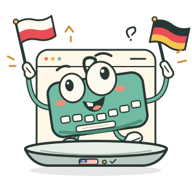

# Language bar



[](https://github.com/skorotkiewicz/language-bar/actions/workflows/build.yml)
[](https://github.com/skorotkiewicz/language-bar/releases/latest)
[](https://aur.archlinux.org/packages/language-bar-bin)
[](LICENSE)

Rust keyboard-layout flag tray for Linux. Uses your active keyboard layout, not the system locale.

<br clear="right">

| Session | Detection and switching | Custom shortcut |
| --- | --- | --- |
| niri, Wayland | niri IPC events | Native niri binding |
| Sway, wlroots Wayland | Sway IPC input events | Native Sway binding |
| X11 | XKB events and group locking | Direct X11 key grab |

Other wlroots compositors, including river, labwc, and Wayfire, are not supported. wlroots does not provide a shared protocol for reading or changing the active keyboard layout. The app reports this instead of showing XWayland's unrelated layout.

## Install

### Arch Linux

Install [`language-bar-bin`](https://aur.archlinux.org/packages/language-bar-bin) from the AUR with `yay`, then start the tray:

```sh
yay -S language-bar-bin
language-bar
```

### From source

```sh
cargo run --release
```

Requires a StatusNotifier tray host, such as Waybar with its `tray` module enabled. Also requires `libxkbcommon` and the system XKB registry, usually provided by `xkeyboard-config` or `xkb-data`. Install `zenity` for shortcut dialogs, or use the CLI instead.

- Left-click cycles layouts. Right-click selects a layout or configures the shortcut.
- Layout changes made outside the app update the flag too.
- Session detection is automatic. Use `--backend niri`, `--backend sway`, or `--backend x11` to override it, for example when testing a nested session.
- On Sway, the first keyboard with configured layouts supplies the indicator. Switching applies to all keyboards.

Flags come from `rs-grid-icons`, which bundles 254 country and territory SVGs. `resvg` renders them offline. Layout names and variants map to countries through the system XKB registry. Layouts without an unambiguous country, such as generic Arabic or Latin American layouts, use a keyboard icon rather than a guessed flag. The tooltip always shows the full layout name. Set `XKB_CONFIG_ROOT` if your XKB data is installed elsewhere.

## Optional shortcut

Disabled by default. Right-click, choose **Configure shortcut...**, enter a binding such as `Ctrl+Alt+L`, then check **Enable shortcut**. Settings survive app restarts. Choose a key not already bound by your desktop or another app.

Modifiers are `Mod`, `Super`, `Ctrl`, `Alt`, and `Shift`, followed by an XKB key name. On X11 and Sway, `Mod` means Super. On niri, it follows niri's configured Mod key.

### niri

Start once, then add this line once to `~/.config/niri/config.kdl`, replacing the home path:

```kdl
include "/home/YOUR_USER/.config/language-bar/shortcut.kdl"
```

Niri reloads the include automatically. The native shortcut also works while the tray is closed.

### Sway

Start once, then add this line once to `~/.config/sway/config`, replacing the home path:

```text
include "/home/YOUR_USER/.config/language-bar/shortcut.conf"
```

Reload Sway after adding the include. Later shortcut changes from the tray reload Sway automatically. The native shortcut also works while the tray is closed.

### X11

No compositor include is needed. The shortcut is registered directly while the tray runs and works with Caps Lock and Num Lock enabled. Conflicting key grabs report an error instead of taking another app's shortcut. Closing the tray releases its shortcut.

### CLI

```sh
cargo run --release -- --shortcut 'Ctrl+Alt+L'  # Set the key without enabling a disabled shortcut.
cargo run --release -- --enable-shortcut
cargo run --release -- --disable-shortcut
cargo run --release -- --toggle               # Switch once without starting the tray.
```

Use CLI shortcut setup before starting the tray. If `XDG_CONFIG_HOME` is set, it replaces `~/.config`. The shortcut dialog and CLI print the exact include path. The config directory retains its original `language-bar` name so existing niri includes keep working.

The app manages its own settings and shortcut includes. It never edits your compositor config or replaces your keyboard keymap.

## Checks

```sh
cargo test
cargo clippy --all-targets -- -D warnings
```
